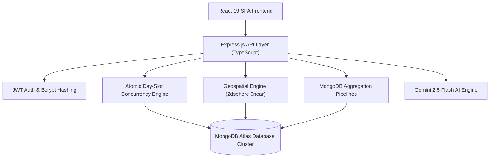

# RentalHub — AI-Powered Universal Equipment Rental Platform

[](https://www.mongodb.com/atlas)
[](https://www.typescriptlang.org/)
[](https://expressjs.com/)
[](https://react.dev/)
[](https://ai.google.dev/)
[](LICENSE)

**RentalHub** is an AI-powered, peer-to-peer equipment rental marketplace and operational platform powered by **MongoDB Atlas**. It connects customer renters with equipment owners and commercial rental fleets across **Construction & Heavy Machinery, Agriculture, Film & Optics, Event Production, Logistics, and Industrial Manufacturing**.

---

## 📋 Table of Contents
1. [Problem Statement](#1-problem-statement)
2. [MongoDB Atlas Core Innovations](#2-mongodb-atlas-core-innovations)
3. [Key Platform Features](#3-key-platform-features)
4. [Technology Stack](#4-technology-stack)
5. [System Architecture & Workflow](#5-system-architecture--workflow)
6. [Setup & Installation Instructions](#6-setup--installation-instructions)
7. [REST API Endpoint Documentation](#7-rest-api-endpoint-documentation)
8. [Security & Application Controls](#8-security--application-controls)

---

## 1. Problem Statement

Equipment rental industries suffer from scheduling friction, double-booking conflicts, manual spreadsheet tracking, and fragmented trust verification. RentalHub solves these challenges through:
- **MongoDB Atlas Atomic Availability Locks**: Compound unique indexing (`{ equipmentId: 1, date: 1 }`) operating inside MongoDB Mongoose transactions, preventing double-booking under high concurrency.
- **Hybrid AI Discovery Engine**: Combining MongoDB Atlas Vector Search (`$vectorSearch`), geospatial proximity (`2dsphere`), and real-time availability filtering.
- **Automated AI Pre-Dispatch Inspection**: Gemini 2.5 Flash multimodal vision analysis storing structured structural integrity reports directly inside MongoDB documents.

---

## 2. MongoDB Atlas Core Innovations

MongoDB Atlas is the central engine powering RentalHub's architecture:

1. **Atlas Vector Search (`$vectorSearch`) & Hybrid Discovery**:
   - Generates 1536-dimensional embeddings for equipment listings.
   - Combines semantic vector similarity with geospatial `$near` distance filters, date availability, and trust score thresholds.

2. **Geospatial Proximity Search (`2dsphere` / `$near`)**:
   - Native GeoJSON Point indexing (`[lng, lat]`) calculating exact kilometer distances between renters and job site equipment yards.

3. **Date-Grouped Aggregation Pipelines (`$group` / `$dateToString`)**:
   - Computes real month-by-month financial yield, daily utilization, downtime loss, and CO2 offset metrics dynamically from actual MongoDB `bookings` documents.

4. **Change Streams & Push Events**:
   - Real-time Server-Sent Events (SSE) push stream connected directly to MongoDB Atlas Change Streams, updating equipment availability across client sessions instantly.

5. **AI Rental Risk Scoring Engine (`POST /api/ai/booking-risk-score`)**:
   - Evaluates a 0–100 Risk Score for every reservation based on MongoDB aggregations over renter trust, owner reliability, asset damage history, and rental duration anomalies.

---

## 3. Key Platform Features

### 👤 Customer Persona
- **Hybrid AI Discovery**: Semantic vector search combined with location, price limit, and trust criteria.
- **Geospatial Map Search**: Interactive Leaflet map powered by OpenStreetMap and Indian geographic boundaries.
- **Live Availability Calendar**: Real-time calendar querying MongoDB `AvailabilityBlockModel` daily date slots.
- **Equipment Comparison Workspace (`/compare`)**: Side-by-side spec, deposit, rate, and trust score comparison.

### 🚜 Owner Persona
- **Fleet Management & Inventory CRUD**: Create, edit, list, and unlist equipment with specs and location coordinates.
- **AI Dynamic Pricing Assistant**: Gemini 2.5 Flash market analytics recommending daily rates based on regional demand.
- **Real-Time Yield Analytics**: Native MongoDB Aggregation Pipelines calculating gross revenue and utilization.

### 🛡️ Admin Persona
- **User Governance & Role Management**: View, update roles, and manage KYC verification status.
- **Equipment Moderation**: Approve or reject owner equipment listings in real time.
- **Immutable Audit Trail (`GET /api/admin/audit-logs`)**: Real-time log of administrative and security events.

---

## 4. Technology Stack

- **Backend Runtime**: Node.js & Express.js 4.21
- **Database Engine**: MongoDB Atlas Cluster via Mongoose ODM 8.13
- **Frontend Architecture**: React 19 SPA & TypeScript 5.8
- **Styling & UI Components**: TailwindCSS v4 & Lucide Icons
- **AI / GenAI Engine**: `@google/genai` (Gemini 2.5 Flash SDK)
- **Security Framework**: `bcryptjs` password hashing, `jsonwebtoken` (JWT), `helmet` security headers, `express-rate-limit`, `zod` schema validation

---

## 5. System Architecture & Workflow



---

## 6. Setup & Installation Instructions

### Prerequisites
- **Node.js**: v18.x or higher
- **MongoDB Atlas Cluster**: URI connection string with a configured database

### 1. Clone Repository & Install Dependencies
```bash
git clone https://github.com/itzmesooraj8/RentalHub.git
cd RentalHub
npm install
```

### 2. Configure Environment Variables
Create a `.env` file in the project root:
```env
PORT=3000
MONGODB_URI=mongodb+srv://<username>:<password>@cluster0.mongodb.net/rentalhub?retryWrites=true&w=majority
JWT_SECRET=rentalhub_super_secret_jwt_key_2026
GEMINI_API_KEY=your_gemini_api_key_here
```

### 3. Seed MongoDB Atlas Cluster
```bash
npm run seed
```

### 4. Run Development Server
```bash
npm run dev
```
Open `http://localhost:3000` in your web browser.

### 5. Execute Automated Test Suite
```bash
npm run test
```

---

## 7. REST API Endpoint Documentation

| Method | Endpoint | Description | Auth Required |
| :--- | :--- | :--- | :--- |
| `POST` | `/api/auth/register` | Create a new user account with bcrypt password hashing | No |
| `POST` | `/api/auth/login` | Authenticate user & issue signed JWT token | No |
| `GET` | `/api/equipment` | Query equipment with category, price, and geospatial filters | No |
| `POST` | `/api/equipment` | Create a new equipment listing | Yes |
| `POST` | `/api/bookings` | Create atomic date-slot locked booking reservation | Yes |
| `POST` | `/api/ai/smart-search` | Multi-stage Hybrid AI Vector + Geospatial Discovery | No |
| `POST` | `/api/ai/booking-risk-score` | AI Rental Risk Score evaluation engine | Yes |
| `POST` | `/api/ai/pre-dispatch-inspection` | Gemini 2.5 Flash pre-dispatch structural inspection | Yes |
| `GET` | `/api/admin/audit-logs` | Retrieve platform security audit trail | Yes (Admin) |

---

## 8. Security & Application Controls

Application-layer security controls include **bcrypt password hashing**, **JWT authentication**, **Role-Based Access Control (RBAC)**, **Helmet security headers**, **Zod input validation**, and **Express rate limiting**.

Data protection measures include PII field masking for identity verification records and immutable audit trail logging (`AuditLogModel`) tracking all administrative status updates, pricing changes, and dispute resolutions.
